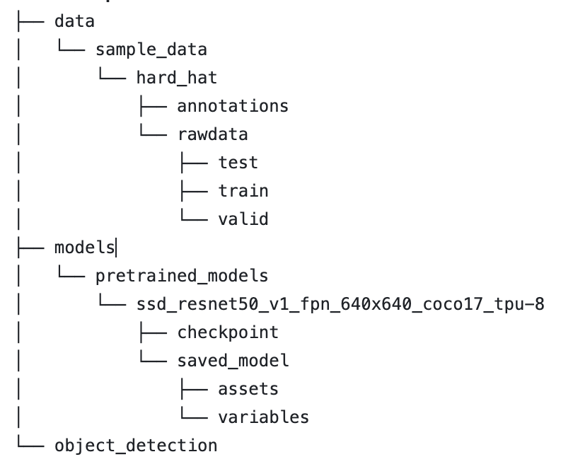

# Roof Detection 

## Preparison

### Setting up Conda Environment

Create Conda environment from the YAML file
```terminal
conda env create -f environment.yml
```

Generate a YAML file in Conda
``` Terminal
conda env export > environment.yml
```

### Pretrained_model
Download the SSD ResNet50 V1 FPN 640x640  model from [TensorFlow 2 Detection Model Zoo](https://github.com/tensorflow/models/blob/master/research/object_detection/g3doc/tf2_detection_zoo.md), unzip and put inside models/pretrain_models

### Workspace Director




## Run

1. Prepare TFRecord 
2. Roof_Detect.ipynb
   
